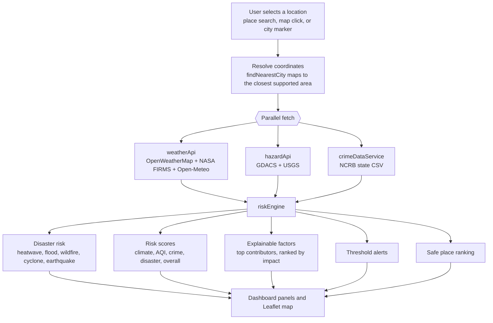
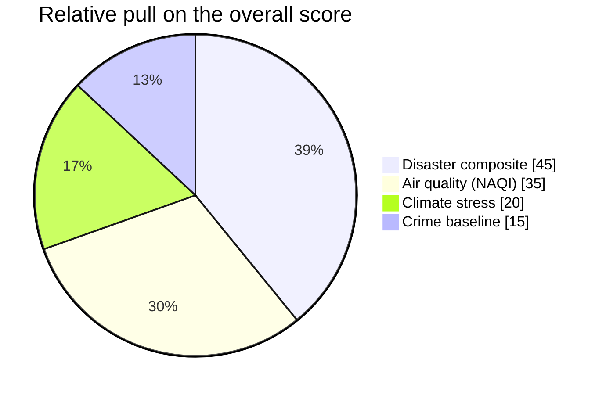

<div align="center">


# RiskTwin India

**A browser based digital twin for multi hazard situational awareness across India.**

Pick any point on the map and RiskTwin pulls live weather, air quality, satellite fire
detections, disaster bulletins and seismic activity for that spot, then folds them into a
single readable risk picture with the reasoning left visible.

[](https://vitejs.dev)
[](https://react.dev)
[](https://www.typescriptlang.org)
[](https://tailwindcss.com)
[](https://vitest.dev)

</div>

---

## Contents

- [What it does](#what-it-does)
- [Live data sources](#live-data-sources)
- [How a location analysis works](#how-a-location-analysis-works)
- [The risk model](#the-risk-model)
- [Interface](#interface)
- [Tech stack](#tech-stack)
- [Project structure](#project-structure)
- [Getting started](#getting-started)
- [npm scripts](#npm-scripts)
- [Testing](#testing)
- [NCRB crime dataset](#ncrb-crime-dataset)
- [Deployment](#deployment)
- [Configuration and limits](#configuration-and-limits)
- [Roadmap](#roadmap)
- [Attribution](#attribution)
- [License](#license)

---

## What it does

RiskTwin India is a single page React application. There is no backend: the browser talks
directly to a set of public APIs, scores the results with a deterministic engine, and
renders the outcome on a Leaflet map plus a column of analysis panels.

Key ideas:

- **One click, many hazards.** A map click, a city marker, or an OpenStreetMap place
  search triggers a full sweep: weather, air quality, active fires, flood and cyclone
  bulletins, earthquakes, and a public safety baseline.
- **Live only.** Runtime analysis never falls back to mock or demo values. If a required
  feed is unreachable the app shows a sync notice instead of inventing numbers.
- **Explainable.** Every score ships with the factors that moved it, a confidence rating,
  and a data completeness percentage, so a user can see why a place reads as high risk.
- **Actionable.** When combined risk is elevated the app ranks nearby supported cities as
  relative safe havens with an estimated risk reduction.

---

## Live data sources

All feeds are queried client side. Keys shown below are free or demo tier and are already
wired in for evaluation.

| Source | Provider | Signals used | Key |
| --- | --- | --- | --- |
| Current weather | OpenWeatherMap `/data/2.5/weather` | temperature, humidity, wind speed and bearing, rainfall, rain probability estimate | demo key committed |
| Air pollution | OpenWeatherMap Air Pollution API | PM2.5 and PM10, converted to the Indian NAQI scale | demo key committed |
| 5 day forecast | OpenWeatherMap `/forecast` (3 hour steps) | daily temperature outlook for the summary chart | demo key committed |
| Fire weather index | OpenWeatherMap FWI forecast | optional wildfire index, falls back to a local Chandler Burning Index when the key is not entitled | optional |
| Active fires | NASA FIRMS `VIIRS_SNPP_NRT` area CSV | 375 m thermal hotspots inside the India bounding box, with fire radiative power, brightness and confidence | MAP_KEY committed |
| Disaster bulletins | GDACS event list API | flood, cyclone, earthquake and wildfire alerts in the last 7 days within 1200 km, weighted by alert colour and distance | none |
| Earthquakes | USGS FDSN event query | events in the last 30 days within 500 km, magnitude 4 and above | none |
| Historical trend | Open-Meteo Archive and Air Quality APIs | mean temperature and daily max US AQI for the fallback trend chart | none |
| Place search | OpenStreetMap Nominatim | forward geocoding for any Indian place name | none |
| Crime baseline | Local CSV derived from NCRB 2022 tables | state and union territory cognizable crime rate per 100k | bundled file |

---

## How a location analysis works



The orchestration lives in [src/pages/Index.tsx](src/pages/Index.tsx). It runs the three
data calls with `Promise.all`, then passes the results through
[src/services/riskEngine.ts](src/services/riskEngine.ts) in this order: disaster risk,
composite scores, explainable factors, alerts, safe places. A failure in any required feed
is caught, surfaced as a toast and an inline notice, and the previous result is cleared.

---

## The risk model

Every score is a number between 0 and 1. Labels follow a fixed scale:
`LOW` below 0.30, `MEDIUM` up to 0.60, `HIGH` at or above 0.60
(see [src/types/risk.ts](src/types/risk.ts)).

### Overall score

The overall score is a weighted average over whatever signals are available, so a missing
crime value or hazard feed does not zero out the result, it just drops from the blend.

| Component | Built from | Weight |
| --- | --- | ---: |
| Disaster composite | the five sub hazards below | 0.45 |
| Air quality | Indian NAQI mapped from 40 to 300 onto 0 to 1 | 0.35 |
| Climate stress | temperature gap from 28 C, humidity gap from 55 percent, wind speed | 0.20 |
| Crime baseline | NCRB state rate, min and max normalised across all states | 0.15 |



### Disaster sub hazards

| Sub hazard | Main inputs | Weight in the disaster composite |
| --- | --- | ---: |
| Flood | rainfall and rain probability, raised to the GDACS flood alert score | 0.26 |
| Heatwave | temperature from 32 to 46 C, dry air bonus | 0.24 |
| Wildfire | heat, dryness and wind, plus NASA FIRMS hotspot count and proximity, raised to the GDACS wildfire score | 0.20 |
| Cyclone | wind and rain probability, a coastal state bonus, raised to the GDACS cyclone score | 0.20 |
| Earthquake | the higher of the GDACS and USGS seismic scores | 0.10 |

When NASA FIRMS reports active hotspots near the selected point, wildfire risk is rebuilt
around fire density and the distance to the closest detection, so a satellite confirmed
fire cannot be washed out by mild weather.

### Air quality

PM2.5 and PM10 are converted to the Indian National Air Quality Index using the standard
CPCB style breakpoints in `calculateIndianAQI`
([src/services/weatherApi.ts](src/services/weatherApi.ts)). The worse of the two sub
indices wins, matching CPCB practice.

### Explainability and safe places

- **Factors.** `computeRiskFactors` emits up to six ranked contributors, for example high
  air pollution, heat stress, active wildfire hotspots, flood susceptibility, or a pending
  crime dataset for that state.
- **Confidence.** Reported as high when at least one hazard feed responded and AQI is
  present, otherwise medium.
- **Safe places.** `computeSafePlacesFromNearest` scores nearby supported cities by
  current risk and Haversine distance, then returns the top five with an estimated risk
  reduction.

Seismic zone tables based on the Bureau of Indian Standards mapping, plus the legacy
scoring helpers, live in [src/services/riskAnalysis.ts](src/services/riskAnalysis.ts) and
are exercised by the test suite.

---

## Interface

| Panel | File | Purpose |
| --- | --- | --- |
| Header | [Header.tsx](src/components/Header.tsx) | branding, system and feed status, light or dark toggle |
| India risk map | [MapView.tsx](src/components/MapView.tsx) | Leaflet map with risk rings, city markers, NASA fire hotspots, and an optional satellite layer |
| Location selector | [LocationSelector.tsx](src/components/LocationSelector.tsx) | floating search backed by Nominatim plus the built in city list |
| Live conditions | [LiveConditionsPanel.tsx](src/components/LiveConditionsPanel.tsx) | eight metric cards and a 5 day temperature and AQI chart |
| Disaster risk | [DisasterRiskPanel.tsx](src/components/DisasterRiskPanel.tsx) | the five sub hazard gauges |
| Risk analysis | [RiskAnalysisPanel.tsx](src/components/RiskAnalysisPanel.tsx) | weighted bars for climate, AQI, crime, disaster and overall |
| Explainability | [ExplainabilityPanel.tsx](src/components/ExplainabilityPanel.tsx) | ranked factors, confidence, data completeness |
| Safe places | [SafePlaceRecommender.tsx](src/components/SafePlaceRecommender.tsx) | ranked havens, click to re analyse from there |
| Alerts | [AlertSystem.tsx](src/components/AlertSystem.tsx) | dismissible threshold alerts |

---

## Tech stack

| Area | Choice |
| --- | --- |
| Build tool | Vite 5 with the SWC React plugin |
| UI | React 18, TypeScript 5.8 |
| Styling | Tailwind CSS 3.4, `tailwindcss-animate`, typography plugin |
| Components | shadcn/ui on Radix primitives |
| Map | Leaflet 1.9 and React Leaflet 4 |
| Charts | Recharts |
| Data fetching | native `fetch`, TanStack Query provider in place |
| Routing | React Router 6 |
| Testing | Vitest, Testing Library, jsdom |

---

## Project structure

```
risktwin-india/
├── public/
│   ├── data/
│   │   └── ncrb_state_crime_rates.csv   NCRB 2022 state and UT crime rates
│   └── favicon.svg                      shield logo mark
├── scripts/
│   └── prepare_crime_dataset.py         rebuilds the crime CSV from an NCRB source table
├── src/
│   ├── components/                      dashboard panels plus the shadcn/ui set
│   ├── data/
│   │   └── locations.ts                 built in Indian cities and findNearestCity
│   ├── hooks/                           useTheme, mobile and toast helpers
│   ├── pages/
│   │   ├── Index.tsx                    analysis orchestration and layout
│   │   └── NotFound.tsx
│   ├── services/
│   │   ├── weatherApi.ts                OpenWeatherMap, Open-Meteo, NAQI, forecast
│   │   ├── firmsApi.ts                  NASA FIRMS VIIRS hotspot fetch and cache
│   │   ├── hazardApi.ts                 GDACS and USGS scoring
│   │   ├── crimeDataService.ts          CSV load and state normalisation
│   │   ├── geocodingService.ts          Nominatim place search
│   │   ├── riskEngine.ts               the engine used at runtime
│   │   └── riskAnalysis.ts             BIS seismic zones and legacy helpers
│   ├── test/                            Vitest specs and setup
│   └── types/
│       └── risk.ts                      shared types and risk level helpers
├── vercel.json                         Vite framework preset and SPA rewrite
└── vite.config.ts                      dev server on port 8080, @ alias to src
```

---

## Getting started

### Prerequisites

- Node.js 20 or newer
- npm 10 or newer

### Install and run

```bash
npm install
npm run dev
```

The dev server starts on `http://localhost:8080` (configured in
[vite.config.ts](vite.config.ts)).

### Production build

```bash
npm run build
npm run preview
```

`npm run build` writes static assets to `dist/`. `npm run preview` serves that build
locally so you can check it before deploying.

---

## npm scripts

| Script | Action |
| --- | --- |
| `npm run dev` | start the Vite dev server with HMR |
| `npm run build` | production build into `dist/` |
| `npm run build:dev` | build using the development mode config |
| `npm run preview` | serve the production build locally |
| `npm run lint` | run ESLint across the project |
| `npm run test` | run the Vitest suite once |
| `npm run test:watch` | run Vitest in watch mode |
| `npm run data:crime:prepare` | regenerate the crime CSV with `scripts/prepare_crime_dataset.py` |

---

## Testing

```bash
npm run test
```

[src/test/apis.test.ts](src/test/apis.test.ts) covers the NAQI calculation, Haversine
distance, BIS seismic zone lookup, the crime baseline, and the multi hazard composite,
and it makes one real call to NASA FIRMS to confirm the feed shape.
[src/test/theme.test.tsx](src/test/theme.test.tsx) checks the light and dark toggle.
Because one test hits a live endpoint, a run needs network access and can be slower or
flaky when NASA FIRMS is rate limiting.

---

## NCRB crime dataset

The crime baseline reads from
[public/data/ncrb_state_crime_rates.csv](public/data/ncrb_state_crime_rates.csv), which
currently holds one 2022 row for each of the 35 states and union territories.

Required columns:

| Column | Notes |
| --- | --- |
| `state` | state or union territory name, matched case and punctuation insensitively |
| `district` | reserved for future district level rows, may be blank |
| `year` | source year, 2022 in the bundled file |
| `crime_rate_per_100k` | cognizable crime rate per 100,000 people |

The loader in [src/services/crimeDataService.ts](src/services/crimeDataService.ts)
averages the rows per state, then min and max normalises across all states to a 0 to 1
score. If a state is absent from the CSV, crime risk stays unavailable for that location
and the explainability panel says so rather than guessing.

To rebuild the file from an NCRB source table, adjust the `SOURCE` and `TARGET` paths in
[scripts/prepare_crime_dataset.py](scripts/prepare_crime_dataset.py) and run
`npm run data:crime:prepare`. Keep official values only and do not add synthetic rows.

---

## Deployment

### Vercel

[vercel.json](vercel.json) sets the Vite framework preset, `npm run build`, an output
directory of `dist`, and a catch all rewrite to `index.html` so client side routes and
deep links survive a refresh.

1. Import the repository in Vercel.
2. Leave the build command as `npm run build` and the output directory as `dist`.
3. Deploy.

### Any static host

```bash
npm run build
```

Upload the contents of `dist/` to any static host. Configure a single page app fallback so
unknown paths serve `index.html`.

---

## Configuration and limits

Worth knowing before you rely on this in the field:

- **Keys are client side.** The OpenWeatherMap key and the NASA FIRMS MAP_KEY are checked
  into the source for a zero setup demo. They are free tier and rate limited. For anything
  beyond evaluation, move them behind your own proxy and rotate them.
- **No backend.** Every request goes straight from the browser to a third party API, so
  availability depends on those services and their CORS behaviour. There is no caching or
  normalisation layer yet, apart from a 5 minute in memory cache for the India wide fire
  feed.
- **Coordinate resolution.** Analysis snaps to the nearest supported area from the built
  in city grid where metadata such as state is required, so a remote click is scored
  against the closest known city.
- **Crime is a coarse baseline.** State level 2022 figures only. There is no district or
  time of day granularity.
- **Scores are heuristics.** The weights and breakpoints are tuned for a readable
  situational picture, not for official guidance. Always defer to IMD, NDMA, CPCB and
  local authorities for decisions.

---

## Roadmap

1. District level NCRB mapping from data.gov.in with an optional yearly refresh job.
2. A server side proxy for key protection, caching, and feed normalisation.
3. Additional hazard overlays, for example INFORM or NDMA context layers.
4. Reverse geocoding so off grid clicks carry real place metadata instead of the nearest
   city.

---

## Attribution

- Map tiles and place search: OpenStreetMap contributors, used under the OpenStreetMap
  terms.
- Fire detections: NASA FIRMS, VIIRS SNPP near real time.
- Disaster bulletins: GDACS, a joint framework of the United Nations and the European
  Commission.
- Seismic data: United States Geological Survey.
- Weather and air quality: OpenWeatherMap and Open-Meteo.
- Crime figures: derived from National Crime Records Bureau 2022 tables.

Respect each provider's terms of use and rate limits when deploying.

## License

This repository does not currently include a license file. Add one before any public or
commercial distribution.
